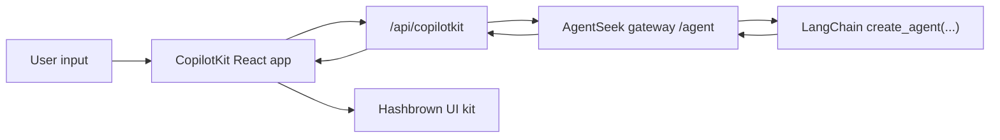

# AG-UI + LangChain

This example follows the LangChain CopilotKit integration shape as closely as possible.
It keeps the LangChain agent, CopilotKit middleware, structured-output bridge, and frontend UI contract aligned with the official guide, and only marks the AgentSeek-specific transport substitutions.

## Mapping

| LangChain guide | This repo | Match | Conversion point |
| --- | --- | --- | --- |
| `create_agent(...)` + `CopilotKitState` + `CopilotKitMiddleware` | [`demo_binding.py`](demo_binding.py) | Yes | None |
| `normalize_context` + `apply_structured_output_schema` | [`middleware.py`](middleware.py) | Yes | None |
| `langgraph.json` + `http.app` custom endpoint | `agentseek gateway --enable-channel ag-ui` + [`build_spec()`](demo_binding.py) | No | FastAPI endpoint replaced by `messages_spec(...)` |
| `runtimeUrl="/api/copilotkit"` | [`frontend/src/App.tsx`](frontend/src/App.tsx) | Yes | None |
| `useAgentContext(...)` + `useUiKit(...)` | [`frontend/src/langchainCopilotKitUi.tsx`](frontend/src/langchainCopilotKitUi.tsx) | Yes | None |
| Custom CopilotKit runtime route | [`frontend/server.ts`](frontend/server.ts) | No | Local Copilot Runtime forwards to AgentSeek `/agent` |

## How it works

1. The backend still uses a normal LangChain `create_agent(...)`.
2. `CopilotKitMiddleware` and the structured-output middleware still run inside LangChain.
3. The frontend still sends chat state to `/api/copilotkit`.
4. The local Copilot Runtime forwards requests to the AgentSeek gateway `/agent`.
5. The gateway invokes the same LangChain agent through `agentseek-langchain` `messages_spec(...)`.
6. Assistant JSON is validated against the Hashbrown schema and rendered as React components.



## Installation

From the repository root:

```bash
uv sync --extra ag-ui --extra langchain
uv pip install -r examples/ag_ui_langchain/requirements.txt
```

Frontend dependencies:

```bash
cd examples/ag_ui_langchain/frontend
npm install
```

## Backend

The backend agent stays guide-shaped. Transport adaptation lives outside `build_agent()`.

```python
from typing import Any, TypedDict

from copilotkit import CopilotKitMiddleware, CopilotKitState
from langchain.agents import create_agent

from ag_ui_langchain.middleware import apply_structured_output_schema, normalize_context
from ag_ui_langchain.settings import get_ag_ui_langchain_demo_settings


class AgentState(CopilotKitState):
    pass


class AgentContext(TypedDict, total=False):
    output_schema: dict[str, Any]


def build_agent() -> Any:
    settings = get_ag_ui_langchain_demo_settings()
    model = settings.model.strip()
    if not model:
        msg = "Set AGENTSEEK_MODEL (e.g. openai:gpt-4o-mini) for the LangChain demo agent."
        raise RuntimeError(msg)

    settings.apply_openai_env_bridge()

    return create_agent(
        model=model,
        tools=[],
        middleware=[
            normalize_context,
            CopilotKitMiddleware(),
            apply_structured_output_schema,
        ],
        context_schema=AgentContext,
        state_schema=AgentState,
        system_prompt=(
            "You are a helpful UI assistant. "
            "Build visual responses using the available components."
        ),
    )
```

Source: [demo_binding.py](demo_binding.py)

### Backend conversion point

The LangChain guide mounts a CopilotKit-aware HTTP app next to the LangGraph deployment.
This example keeps the same agent shape and swaps only the transport layer:

```python
from agentseek_langchain import messages_spec

def build_spec():
    return messages_spec(build_agent(), include_agents_md=True)
```

Source: [demo_binding.py](demo_binding.py)

## Middleware

The middleware layer follows the guide pattern: normalize CopilotKit context, then turn `output_schema` into LangChain structured output.

```python
import json
from collections.abc import Mapping

from langchain.agents.middleware import before_agent, wrap_model_call
from langchain.agents.structured_output import ProviderStrategy

_DEFAULT_OUTPUT_SCHEMA_TITLE = "structured_response"


@wrap_model_call
async def apply_structured_output_schema(request, handler):
    schema = None
    runtime = getattr(request, "runtime", None)
    runtime_context = getattr(runtime, "context", None)

    if isinstance(runtime_context, Mapping):
        schema = runtime_context.get("output_schema")

    if schema is None and isinstance(getattr(request, "state", None), dict):
        copilot_context = request.state.get("copilotkit", {}).get("context")
        if isinstance(copilot_context, list):
            for item in copilot_context:
                if isinstance(item, dict) and item.get("description") == "output_schema":
                    schema = item.get("value")
                    break

    if isinstance(schema, str):
        try:
            schema = json.loads(schema)
        except json.JSONDecodeError:
            schema = None

    if isinstance(schema, dict):
        title = schema.get("title")
        if not isinstance(title, str) or not title.strip():
            schema = {**schema, "title": _DEFAULT_OUTPUT_SCHEMA_TITLE}
        request = request.override(
            response_format=ProviderStrategy(schema=schema, strict=True),
        )

    return await handler(request)


@before_agent
def normalize_context(state, runtime):
    copilotkit_state = state.get("copilotkit", {})
    context = copilotkit_state.get("context")

    if isinstance(context, list):
        normalized = [
            item.model_dump() if hasattr(item, "model_dump") else item
            for item in context
        ]
        return {"copilotkit": {**copilotkit_state, "context": normalized}}

    return None
```

Source: [middleware.py](middleware.py)

## Frontend

The frontend keeps the same contract as the guide: `CopilotKit` provides the runtime, `useAgentContext(...)` sends the schema, and assistant output is parsed before rendering.

```tsx
import { CopilotChat, CopilotKit } from "@copilotkit/react-core/v2";
import "@copilotkit/react-core/v2/styles.css";

import {
  HashbrownAssistantMarkdown,
  LangChainGenerativeUiProvider,
} from "./langchainCopilotKitUi";

const RUNTIME_URL =
  import.meta.env.VITE_COPILOTKIT_RUNTIME_URL || "/api/copilotkit";

export function App() {
  return (
    <CopilotKit runtimeUrl={RUNTIME_URL} useSingleEndpoint={false}>
      <LangChainGenerativeUiProvider>
        <div className="app-root">
          <CopilotChat
            agentId="default"
            messageView={{
              assistantMessage: {
                markdownRenderer: HashbrownAssistantMarkdown,
              },
            }}
          />
        </div>
      </LangChainGenerativeUiProvider>
    </CopilotKit>
  );
}
```

Source: [frontend/src/App.tsx](frontend/src/App.tsx)

### UI registry

```tsx
import { s } from "@hashbrownai/core";
import { exposeComponent, exposeMarkdown, useUiKit } from "@hashbrownai/react";
import { useAgentContext } from "@copilotkit/react-core/v2";

export function LangChainGenerativeUiProvider({
  children,
}: {
  children: React.ReactNode;
}) {
  const kit = useUiKit({
    components: [
      exposeMarkdown(),
      exposeComponent(Card, {
        name: "card",
        description: "Card to wrap generative UI content.",
        children: "any",
      }),
      exposeComponent(Row, {
        name: "row",
        description: "Horizontal row layout.",
        props: {
          gap: s.string("Tailwind gap size") as never,
        },
        children: "any",
      }),
      exposeComponent(Column, {
        name: "column",
        description: "Vertical column layout.",
        children: "any",
      }),
      exposeComponent(SimpleChart, {
        name: "chart",
        description: "Simple bar-style chart for numeric series.",
        props: {
          labels: s.array("Category labels", s.string("A label")),
          values: s.array("Numeric values", s.number("A value")),
        },
        children: false,
      }),
      exposeComponent(CodeBlock, {
        name: "code_block",
        description: "Syntax-highlighted code block.",
        props: {
          code: s.streaming.string("The code to display"),
          language: s.string("Programming language") as never,
        },
        children: false,
      }),
      exposeComponent(Button, {
        name: "button",
        description: "Clickable button.",
        children: "text",
      }),
    ],
  });

  useAgentContext({
    description: "output_schema",
    value: s.toJsonSchema(kit.schema),
  });

  return (
    <LangChainUiKitContext.Provider value={kit}>
      {children}
    </LangChainUiKitContext.Provider>
  );
}
```

Source: [frontend/src/langchainCopilotKitUi.tsx](frontend/src/langchainCopilotKitUi.tsx)

### Assistant rendering

```tsx
import { CopilotChatAssistantMessage } from "@copilotkit/react-core/v2";
import { useJsonParser } from "@hashbrownai/react";
import { memo } from "react";

const HashbrownAssistantMarkdownInner = memo(function HashbrownAssistantMarkdownInner({
  kit,
  content,
  className,
  ...rest
}) {
  const { value } = useJsonParser(content ?? "", kit.schema);

  if (value) {
    const nodes = kit.render(value);
    return (
      <div className={`magic-text-output ${className ?? ""}`.trim()} {...rest}>
        {nodes}
      </div>
    );
  }

  if (!content?.trim()) {
    return null;
  }

  return (
    <CopilotChatAssistantMessage.MarkdownRenderer
      content={content}
      className={className}
      {...rest}
    />
  );
});
```

Source: [frontend/src/langchainCopilotKitUi.tsx](frontend/src/langchainCopilotKitUi.tsx)

### Frontend conversion point

The LangChain guide mounts `/api/copilotkit` next to the deployment.
This example keeps the same route shape and moves the runtime bridge into the frontend workspace:

```ts
import { HttpAgent } from "@ag-ui/client";
import { CopilotRuntime } from "@copilotkit/runtime/v2";
import { createCopilotExpressHandler } from "@copilotkit/runtime/v2/express";
import express from "express";

const port = Number(process.env.COPILOTKIT_PORT || 4001);
const basePath = "/api/copilotkit";
const agentseekAgentUrl =
  process.env.AGENTSEEK_AG_UI_AGENT_URL || "http://127.0.0.1:8088/agent";

const runtime = new CopilotRuntime({
  agents: {
    default: new HttpAgent({
      url: agentseekAgentUrl,
    }),
  },
});

const app = express();

app.use(
  createCopilotExpressHandler({
    runtime,
    basePath,
    cors: true,
  }),
);
```

Source: [frontend/server.ts](frontend/server.ts)

## Configure

Create the example-local env file:

```bash
cp examples/ag_ui_langchain/.env.example examples/ag_ui_langchain/.env
```

Required variables:

```bash
AGENTSEEK_MODEL=...
AGENTSEEK_API_KEY=...
AGENTSEEK_API_BASE=...
AGENTSEEK_LANGCHAIN_SPEC=ag_ui_langchain.demo_binding:build_spec
AGENTSEEK_STREAM_OUTPUT=true
PYTHONPATH=examples
```

If the model id starts with `openai:` and `OPENAI_*` is unset, [`settings.py`](settings.py) bridges `AGENTSEEK_API_KEY` and `AGENTSEEK_API_BASE` into `OPENAI_API_KEY` and `OPENAI_API_BASE`.

## Run

Start the gateway:

```bash
uv run --env-file .env --env-file examples/ag_ui_langchain/.env \
  agentseek gateway --enable-channel ag-ui
```

Start the frontend runtime and Vite app:

```bash
cd examples/ag_ui_langchain/frontend
npm run dev
```

Default ports:

- Vite: `http://127.0.0.1:5174`
- Copilot Runtime: `http://127.0.0.1:4001`
- AgentSeek gateway: `http://127.0.0.1:8088`

## Verify

```bash
curl -s http://127.0.0.1:4001/health
cd examples/ag_ui_langchain/frontend
npm run build
uv run pytest examples/ag_ui_langchain/test_middleware.py
```

## Files

| File | Role |
| --- | --- |
| [`demo_binding.py`](demo_binding.py) | LangChain agent definition + AgentSeek `messages_spec` binding |
| [`middleware.py`](middleware.py) | CopilotKit context normalization + structured output bridge |
| [`settings.py`](settings.py) | Demo env loading + `openai:` credential bridge |
| [`test_middleware.py`](test_middleware.py) | Example-local regression test for schema normalization |
| [`frontend/src/App.tsx`](frontend/src/App.tsx) | CopilotKit app shell |
| [`frontend/src/langchainCopilotKitUi.tsx`](frontend/src/langchainCopilotKitUi.tsx) | UI kit registration + assistant structured rendering |
| [`frontend/server.ts`](frontend/server.ts) | Local Copilot Runtime forwarding to AgentSeek gateway |
